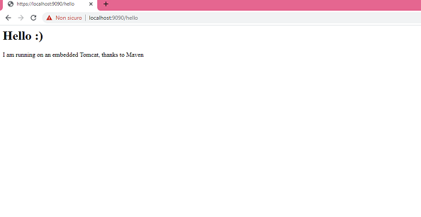
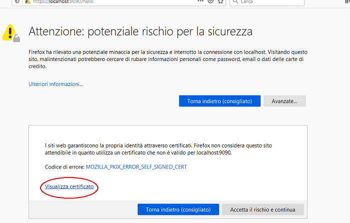
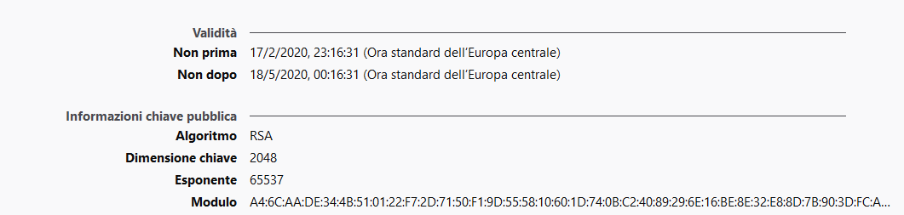

# Embedded-tomcat-ssl

Questo è un quick start per usare tomcat-embedded con jks (certificato ssl) in windows.


# Creazione certificato self-signed in Windows

* Vai nella directory dove è installato java (per esempio in **C:\Program Files\Java**), e prosegui sotto a bin dove è presente **keytool.exe**

* Copia il percorso ed apri il prompt dei comandi di windows in modalità amministratore

* Esegui nel prompt: ```cd <percorso> ```, ove tra parentesi angolari c'è il percorso copiato precedentemente.

* Lancia:

```
keytool -genkey -noprompt -alias <your-alias> -keyalg RSA -keystore <your-file-name> -keypass <your-password> -storepass <your-password> -dname "CN=<your-cert-name>, OU=<your-organization-unit>, O=<your-organization>, L=<your-location>, ST=<state>, C=<two-letter-country-code>"
```

> Fai attenzione a sostituire i parametri in parentesi angolari con i tuoi valori. In questo esempio i valori sono:
```
keytool -genkey -noprompt -alias tomcat -keyalg RSA -keystore .keystore -keypass changeit -storepass changeit -dname "CN=localhost-rsa, OU=amanga, O=amangafull, L=Nola, ST=Italia, C=IT"
```

* Copia il file **.keystore** nella user home

# Come usare questo quick start maven

## Startare con maven

```
mvnw tomcat7:run
```

Si avrà allora:

```
[INFO] Scanning for projects...
[INFO]
[INFO] ------------------------------------------------------------------------
[INFO] Building How To Run Embedded Tomcat with Maven 0.0.1-SNAPSHOT
[INFO] ------------------------------------------------------------------------
[INFO]
[INFO] >>> tomcat7-maven-plugin:2.2:run (default-cli) @ how-to-run-embedded-tomcat-with-maven >>>
[INFO]
[INFO] --- maven-resources-plugin:2.6:resources (default-resources) @ how-to-run-embedded-tomcat-with-maven ---
[INFO] Using 'UTF-8' encoding to copy filtered resources.
[INFO] Copying 0 resource
[INFO]
[INFO] --- maven-compiler-plugin:2.3.2:compile (default-compile) @ how-to-run-embedded-tomcat-with-maven ---
[INFO] Nothing to compile - all classes are up to date
[INFO]
[INFO] <<< tomcat7-maven-plugin:2.2:run (default-cli) @ how-to-run-embedded-tomcat-with-maven <<<
[INFO]
[INFO] --- tomcat7-maven-plugin:2.2:run (default-cli) @ how-to-run-embedded-tomcat-with-maven ---
[INFO] Running war on https://localhost:9090/
[INFO] Creating Tomcat server configuration at C:\JavaCreed\examples\maven\How To Run Embedded Tomcat with Maven\target\tomcat
[INFO] create webapp with contextPath:
Mar 20, 2014 4:00:05 PM org.apache.coyote.AbstractProtocol init
INFO: Initializing ProtocolHandler ["http-bio-9090"]
Mar 20, 2014 4:00:05 PM org.apache.catalina.core.StandardService startInternal
INFO: Starting service Tomcat
Mar 20, 2014 4:00:05 PM org.apache.catalina.core.StandardEngine startInternal
INFO: Starting Servlet Engine: Apache Tomcat/7.0.47
Mar 20, 2014 4:00:07 PM org.apache.coyote.AbstractProtocol start
INFO: Starting ProtocolHandler ["http-bio-9090"]
```


Apri il browser:

```
https://localhost:9090/hello
```




* E' stata inserita questa configurazione nel pom.xml :

```
<plugin>
        <groupId>org.apache.tomcat.maven</groupId>
        <artifactId>tomcat7-maven-plugin</artifactId>
        <version>2.2</version>
        <configuration>
         <path>/</path>
		<!-- https protocol -->
		 <protocol>org.apache.coyote.http11.Http11NioProtocol</protocol>
		  <httpsPort>9090</httpsPort>
		  <!-- disable http 8080 default port-->
		 <port>0</port>
		<!-- default keystoreFile is under windows home/.keystore. 
		 Uncomment to override path with keystoreFile (but it does not override path with executable jar!!) -->
		 
        <!-- <keystoreFile>${basedir}/.keystore</keystoreFile>
         <keystorePass>changeit</keystorePass> -->
        </configuration>
</plugin>

```

> Il parametro port a zero disabilita l'esposizione dell'applicazione anche sull l'http (di default tomcat parte sulla porta 8080)


## Builda il progetto

* Creare il jar autoeseguibile:

```
mvnw clean package
```

> Avrai un jar sotto a target con suffisso **war-exec** . 

* Run:

 ```java -jar <nome-jar> --httpsPort 9090 --keyAlias tomcat```


## Note

* Sotto a questo repository c'è il **.keystore** generato ed usato dal quick start
* Il jks keystore generato è autosegnato e **non sicuro**, ovvero non censito dalle autorità di certificati (vedi i link utili per richiedere il **ca**). Ogni autority fornisce un form con le istruzioni da seguire per poter avere un certificato validato, fornendo host dell'applicazione ed informazioni sulla ragione sociale dell'azienda o cliente.
* E' possibile visualizzare la creazione e la scadenza del certificato dal browser:







## Link utili

* https://docs.oracle.com/cd/E19798-01/821-1751/ghlgv/index.html
* https://tomcat.apache.org/tomcat-8.0-doc/ssl-howto.html
* https://www.ionos.it/digitalguide/siti-web/creare-siti/come-si-migra-una-pagina-da-http-a-ssl-e-https/
* Per acquisti certificati: https://promo.register.it/positive-ssl/?idl=5a200abc8b0862003e2be00f&idv=5910291b3f474a00176976c3&idc=5a200b8b8b08620083310c28&PR=EG14&ida=5a200c088b0862004499d719
* Per certificati validi solo in localhost: https://www.html.it/25/06/2018/localhost-e-certificati-ssl-i-consigli-di-lets-encrypt/

